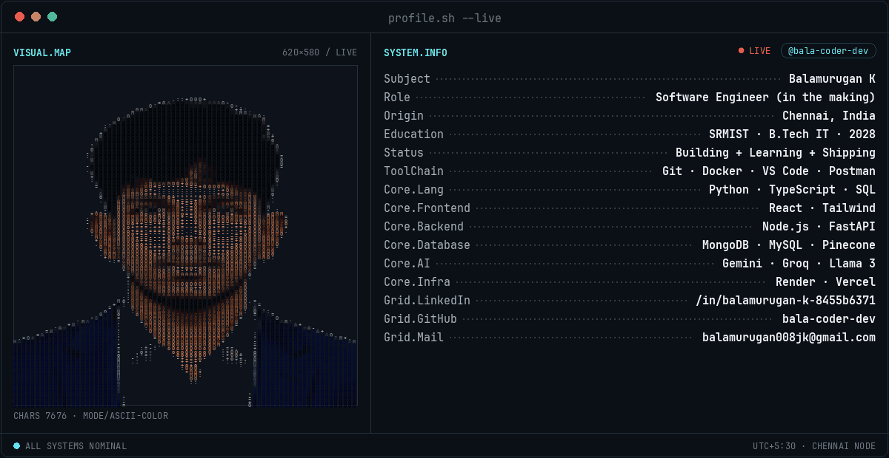

  

<b>BUILDING</b> &nbsp;•&nbsp; <b>LEARNING</b> &nbsp;•&nbsp; <b>SHIPPING</b>
 
Backend Systems · APIs · Cloud · AI

  

  

 

 

## `// ABOUT ME`

<table width="100%">
<tr>
<td valign="top" width="62%">

Hey, I'm Balamurugan — a 3rd-year B.Tech Information Technology student at SRMIST, building toward a career in software engineering.

I enjoy turning ideas into working systems: backend APIs, data-driven applications, and AI-powered products. Two of those ideas are now live — a multi-agent platform that has AI "executives" debate a business decision, and a bot that reviews pull requests.

I believe the best way to learn software engineering is to keep building, so that's what I'm doing.

</td>
<td valign="top" width="38%">

**CURRENTLY**
 ─────────

Learning `System Design` `DSA`
  
Building `Backend APIs` `AI Agents`
  
Exploring `Cloud Deploys` `GenAI`

</td>
</tr>
</table>

 

## `// CURRENTLY`

<table width="100%">
<tr>
<td align="center" width="25%">

**LEARNING**
 Python · DSA · System Design

</td>
<td align="center" width="25%">

**BUILDING**
 Backend APIs · AI-powered apps

</td>
<td align="center" width="25%">

**EXPLORING**
 Cloud deploys · GenAI · Vector search

</td>
<td align="center" width="25%">

**MISSION**
 Become a strong engineer by shipping

</td>
</tr>
</table>

 

## `// ACTIVITY`

 

Live GitHub data — updates automatically as the account grows.

 

## `// TROPHY CASE`

Fills in automatically as repos, stars, and activity grow — this is what it shows today.

 

## `// FEATURED BUILDS`

<table width="100%">
<tr>
<td width="50%" valign="top">

**01**
### SME Nexus AI
Autonomous multi-agent platform — 7 specialized AI executives collaborate to generate enterprise strategy, with an orchestration layer resolving conflicting recommendations.

`React` `TypeScript` `Node.js` `Gemini` `Pinecone`

 

[**VIEW PROJECT →**](https://github.com/bala-coder-dev/SME-Nexus-AI)

</td>
<td width="50%" valign="top">

**02**
### PR Review Copilot
LLM-powered pull request reviewer — parses diffs with tree-sitter and posts structured review comments through an HMAC-verified GitHub webhook pipeline.

`Python` `FastAPI` `Groq` `Llama 3` `tree-sitter`

 

[**VIEW PROJECT →**](https://github.com/bala-coder-dev/pr-review-copilot)

</td>
</tr>
</table>

 

## `// ACHIEVEMENTS`

<table width="100%">
<tr>
<td align="center" width="33%">

**01**
 
**FINALIST**
 
Agentic Arena 2026
 
880+ participants

</td>
<td align="center" width="33%">

**02**
 
**2nd PRIZE**
 
Quantathon 2026
 
National hackathon

</td>
<td align="center" width="33%">

**03**
 
**3rd RANK**
 
Mind & Machine — AI Quiz
 
58.5 / 60 · 97.5%

</td>
</tr>
</table>

 

## `// TECH STACK`

 

`AI / ML LAYER`
&nbsp;&nbsp;`Google Gemini` `Groq` `Llama 3` `Pinecone (Vector DB)` `Prompt Engineering` `Multi-Agent Systems`

 

 

## `// CONNECT`

**LET'S BUILD SOMETHING.**
 
Always interested in learning, building, and connecting with other developers.

  

 

---

<b>BUILDING TODAY. LEARNING EVERY DAY.</b>
 
© Balamurugan K

